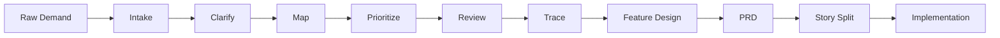

# Requirement Management Workflow

This project includes a dedicated Requirement Management Pack for turning raw stakeholder input into traceable, prioritized, reviewable engineering work.

## Command Sequence

```text
@product-dev /requirements-intake
@product-dev /requirements-clarify
@product-dev /requirements-map
@product-dev /requirements-prioritize
@product-dev /requirements-review
@product-dev /requirements-trace
@product-dev /feature
@product-dev /prd
@product-dev /story-split
@product-dev /prd-json
```

## When To Use Each Command

| Command | Use When | Main Output |
|---|---|---|
| `/requirements` | You want a one-shot organization of messy demand | `docs/01-requirements/requirements-overview.md` |
| `/requirements-intake` | You have raw notes, stakeholder text, meeting summary, or attachments | `docs/01-requirements/requirements-intake.md` |
| `/requirements-clarify` | The request is ambiguous or missing key business context | `docs/01-requirements/requirements-clarification.md` |
| `/requirements-map` | You need to connect goals, needs, features, stories and tests | `docs/01-requirements/requirements-map.md` |
| `/requirements-prioritize` | You need MVP scope, phased scope, or stakeholder trade-offs | `docs/01-requirements/requirements-prioritization.md` |
| `/requirements-review` | You need a quality gate before PRD or development | `docs/01-requirements/requirements-review.md` |
| `/requirements-trace` | You need auditability from requirements to code/data/tests/release | `docs/01-requirements/requirements-traceability.md` |

## Requirement Lifecycle



## Required Inputs

- User problem statement
- Target users / roles
- Business goal
- Current process or system
- In-scope and out-of-scope areas
- Data/API/UI dependencies
- Security/privacy/compliance constraints
- Acceptance criteria and measurable success indicators

## Quality Gate Before PRD

A requirement should not move to PRD until it has:

- Stable ID
- Clear business goal
- User / role
- Scope boundary
- Acceptance criteria
- Priority
- Dependencies
- Risk classification
- Traceability target

## Integration With Existing Workflows

Requirement outputs feed into:

- `/feature` for feature design
- `/prd` for product requirements
- `/story-split` and `/prd-json` for Ralph-style loop execution
- `/architecture-diagram` and `/journey-diagram` for visuals
- `/task`, `/test`, `/review`, `/release` for delivery governance
